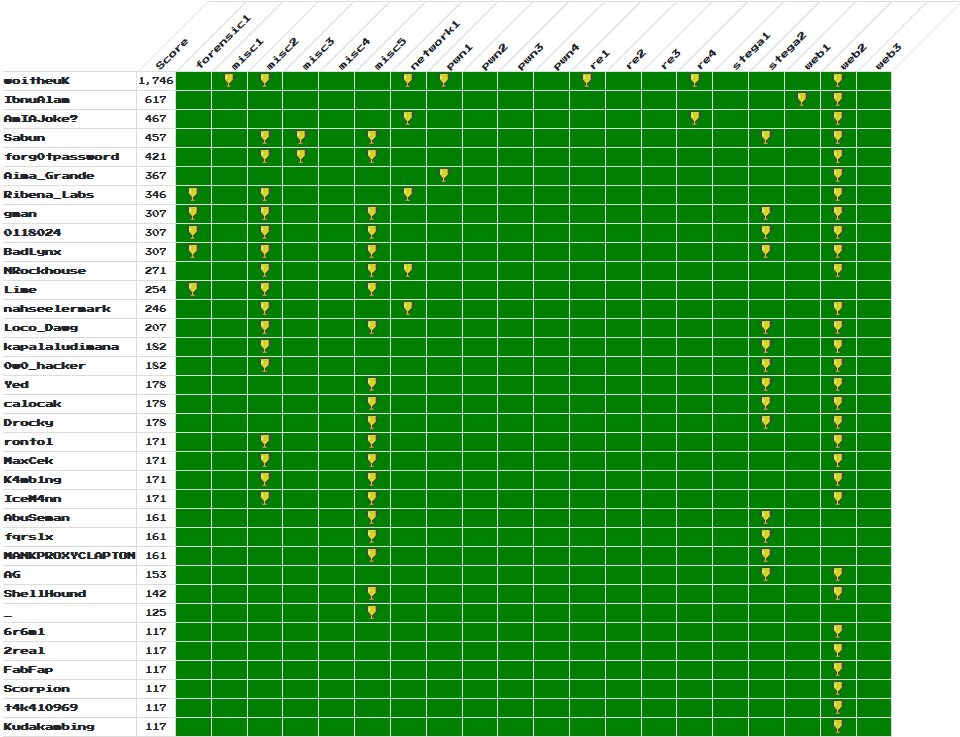

# NanoSec X Wargames.MY 2019

#### *CTF Information*

```text
Where: Online
When: 28/09/2019 12:01 AM - 29/09/2019 1:00 AM
Format: Jeopardy with a twist
URL: https://nanosec.asia/nsc2019/
Discord: https://discord.gg/HMPURT2
```

#### *Prize*

```text
Top three wins 1x NanoSec Conference 2019 ticket (worth MYR 349) and an exclusive limited edition Wargames.MY medal each.

Top scorers will get a chance to participate as a team of 3 at Regional Cyber Challenge 2019 worth USD 300, sponsored by RawSEC
```

#### *Gameplay*

```text
1. This game is dynamically scored. It means that point is divided by the number of solves for any particular question.
2. Each question will have an initial base point of 500 and decreases by the number of solves.
3. Every player initially will be rewarded by 100 points.
4. Every question is placed in the queue system.
5. After a player has managed to solve one question, a new question that is in the queue will be unlocked for them.
6. Team can buy a new question beforehand, and the next question that is in the queue will be unlocked for them.
     6.1 For example, player A has unlocked three questions, but unable to solve any of them, so they can buy a new question which in the queue.
     6.2 Price for a question in the queue is 100 points.
     6.3 Marketplace transaction is final and not refundable.
7. Questions that are in the queue is same for every player, so everyone will have the same order of questions.
8. Initially (at the start of the game), three (3) questions will be unlocked for everyone.
9. For every two (2) hours, a new question that is in the queue will be released for players that haven't unlocked the question yet.
     9.1 For example, question 7 is in the queue and it is time for the system to release the question.
          9.1.1 For the player that has unlocked that, then they will receive nothing (as they have unlocked that)
          9.1.2 For the player that hasn't unlocked that yet, it will be unlocked for them
10. Hint for the question is available, but you need to pay your point for that.
     10.1 The price of hint is dynamically changed as well, depending on number of solves.
     10.2 For zero until two solves, the price of hint will be 100 points.
     10.3 For third solves and above, the price of hint will be calculated as (500 / number_of_solves / 2)
     10.4 Price for the hint will be deducted from your current points
     10.5 Hint transaction is final and not refundable.
```

#### *Rules*

```text
We try hard to keep the competition as free and exciting as possible; however, we do require players to adhere to a few simple rules:

1. Only Malaysian citizen is eligible for the prize.
2. No off-the-shelf automated scanning tools such as Nessus, OpenVAS, etc. It's useless and we'll kick you out for that lame ass shit.
3. No cooperation between players with independent accounts. Sharing of flags or providing revealing hints to other players is cheating, don't do it.
4. No attacking the competition infrastructure. If bugs or vulns are found, please alert the competition organizers immediately
5. Absolutely no sabotaging of other competing players, or in any way hindering their independent progress.
6. No brute forcing of challenge flag / keys against the scoring server
7. No flooding and / or DoS attacks. Teams caught in the act will be penalized by a time penalty or a disqualification.
8. No ARP spoofing. Teams caught in the act will be penalized by a time penalty or a disqualification.
9. The rules and regulations will or might be updated without prior notice.
10. At all times, the decision of the WGMY Crew is final on any matter in question.

Rules might be updated from time to time, without prior notice.
```

#### *Write-up*
* [Pwnme](https://github.com/nafiez/various-stuff/blob/master/wargamesXnanosec%20-%20pwnme%20challenge%20(partial%20writeup))

#### *Final Scoreboard*


